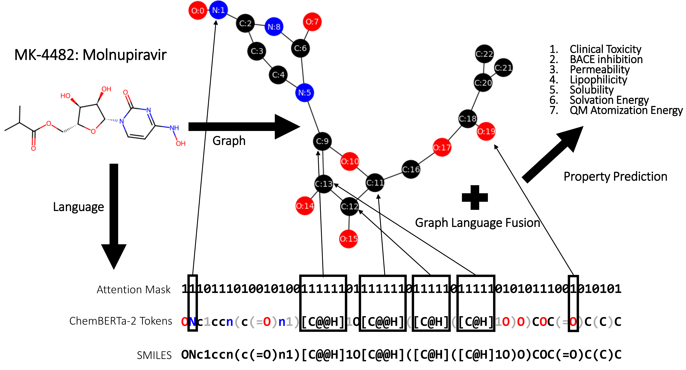

# MolPROP: Molecular Property Predictions with Multimodal Language and Graph Fusion

fuses molecular language and graph representation for property prediction

current models include:
- language -- ChemBERTa-2-77M-MLM, ChemBERTa-2-77M-MTR
- graph -- GCN, GAT, GATv2

```
@article{rollins2023,
        title = {{MolPROP}: {Molecular} {PROPerty} {Prediction} with {Multimodal} {Language} and {Graph} {Fusion}},
        journal = {preprint},
        author = {Rollins, Zachary A and Cheng, Alan C and Metwally, Essam},
        month = dec,
        year = {2023}}
```



## requirements
- git lfs (for locally stored language models)
    - install git lfs for your machine: https://github.com/git-lfs/git-lfs
    - chemberta requires local installation to config: https://huggingface.co/DeepChem
- molprop.yaml
```
    conda env create --name molprop --file molprop.yaml
```

## preprocess data
### data splitting
- data splits to reproduce manuscript results are provided: ./data/*csv
- data should be in data directory (e.g., csv format) and organized such that SMILES string and endpoints are in separate columns
- data can be split using the Bemis-Murko scaffold split implemented by DeepChem
- explore the help options to execute the data split procedure
```
    python ./data/split.py --help
```
## train and hyperparameter tune
- training and tuning execution is specified by the configuration files (config/setup.json)
```
    python ./src/train_tune.py
```

### hyperparameter tune
- setup["training"]["ray_tune"] == True
- specify hyperparameter search space in the '__main__' of ./src/train_tune.py
- ray cluster must be initialized before hyperparameter tuning execution
- submit PBS script with specified num_cpus and num_gpus
- start ray cluster
```
    ray start --head --num-cpus=8 --num-gpus=4 --temp-dir="/absolute/path/to/temporary/storage/"
    python ./src/train_tune.py
```

### inference and holdout
- test trained/validated models on holdout by specifying config/setup.json
- MolPROP models trained on data in manuscript are located in models/weights
- setup['holdout']['model_path']
- setup['holdout']['holdout_data_path]
```
    python ./src/holdout.py
```


### logging information and model storage
- train_tune.log files are recorded and saved for every time stamped batch run
- runs are also recorded on tensorboard
- ***** = unqiue file identifier (e.g., time stamp or number)
```
    logs/batch_*****/train_tune.log
    logs/batch_*****/events.out.tfevents.***** (setup["training"]["ray_tune"] == False)
    logs/batch_*****/ray_tune/hp_tune_*****/checkpoint_*****/events.out.tfevents.***** (setup["training"]["ray_tune"] == True)
```

- hyperparameter tune runs are implemented by ray tune and models are stored
- non-hyperparameter tuned models are also stored
```
    logs/batch_*****/ray_tune/hp_tune_*****/checkpoint_*****/dict_checkpoint.pkl (setup["training"]["ray_tune"] == True)
    models/weights/batch_*****/MOLPROP*****.pth (setup["training"]["ray_tune"] == False)
```

# License
    MolPROP fuses molecular language and graph for property prediction.
    Copyright © 2023 Merck & Co., Inc., Rahway, NJ, USA and its affiliates. All rights reserved.

    This program is free software: you can redistribute it and/or modify
    it under the terms of the GNU General Public License as published by
    the Free Software Foundation, either version 3 of the License, or
    (at your option) any later version.

    This program is distributed in the hope that it will be useful,
    but WITHOUT ANY WARRANTY; without even the implied warranty of
    MERCHANTABILITY or FITNESS FOR A PARTICULAR PURPOSE.  See the
    GNU General Public License for more details.

    You should have received a copy of the GNU General Public License
    along with this program.  If not, see <http://www.gnu.org/licenses/>.
